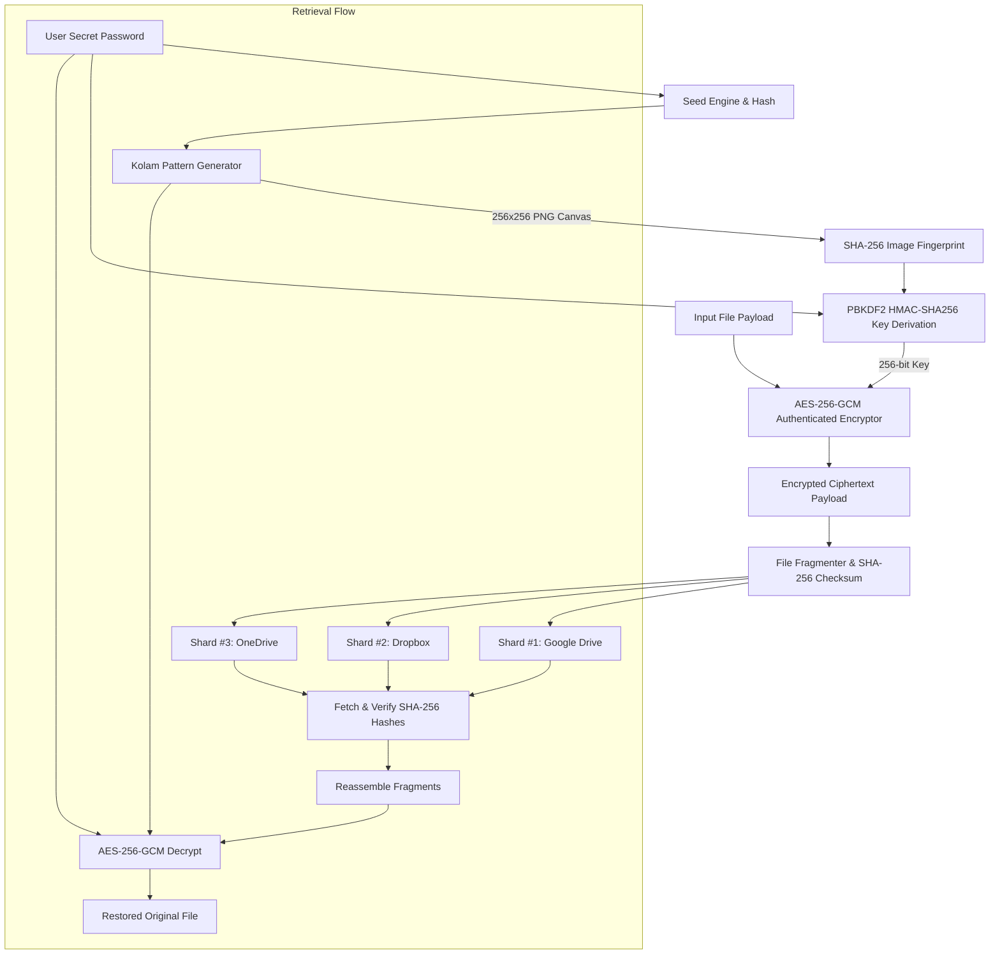

# 🎨 KolamCrypt: AI/Mathematical Kolam Pattern File Encryption & Multi-Cloud Storage

**KolamCrypt** is an innovative cryptographic security platform that combines traditional South Indian floor art (**Kolam**) pattern generation with **AES-256-GCM authenticated encryption**, **PBKDF2 key derivation**, and **fragmented multi-cloud storage distribution**.

---

## 🌟 Key Features

1. **Procedural Seed-Based Kolam Pattern Generator (`kolam_generator.py`)**:
   - Generates unique, symmetrical 256x256 Pulli/Sikku Kolam dot-grid loop patterns mathematically.
   - 100% offline, GPU-free, and deterministic based on seed or password hashing.
2. **Cryptographic Key Derivation (`key_derivation.py`)**:
   - Combines user password + SHA-256 fingerprint of the generated Kolam pattern image.
   - Derives a 256-bit AES master key using **PBKDF2-HMAC-SHA256** with 100,000 iterations and salt.
3. **AES-256-GCM Authenticated Encryption (`encryptor.py`)**:
   - Prevents unauthorized modification or tampering via GCM authentication tags and 12-byte nonces.
4. **Multi-Cloud Fragmented Storage (`fragmenter.py`, `cloud_storage.py`)**:
   - Splits ciphertext payloads into $N$ fragments (default $N=3$).
   - Generates SHA-256 checksums per shard and distributes them across simulated Google Drive, Dropbox, and OneDrive storage locations.
5. **SQLite Metadata Repository (`database.py`)**:
   - Stores file metadata, Kolam pattern image links, and fragment hashes securely.
6. **Multiple Interface Options**:
   - **Streamlit Web Dashboard (`app.py`)**
   - **Terminal Interactive CLI (`main.py`)**
   - **Vercel Glassmorphic Web App (`public/` & `api/index.py`)**

---

## 📐 Architecture & Security Workflow



---

## 🚀 Quick Start Guide

### 1. Installation

Clone or extract the repository, then install Python dependencies:

```bash
cd kolamcrypt
pip install -r requirements.txt
```

---

### 2. Option A: Streamlit Interactive Dashboard

Launch the rich multi-tab Streamlit dashboard:

```bash
streamlit run app.py
```

Open your browser at `http://localhost:8501`.

---

### 3. Option B: Terminal CLI Interface

Run the interactive terminal CLI:

```bash
python main.py
```

---

### 4. Option C: Local FastAPI Serverless Web App

Run the FastAPI backend locally:

```bash
uvicorn api.index:app --reload --port 8000
```

Open `public/index.html` directly or serve via local HTTP server (`python -m http.server 3000`).

---

### 5. Option D: Deploy to Vercel

KolamCrypt is fully configured for zero-setup Vercel deployment!

1. Install Vercel CLI:
   ```bash
   npm i -g vercel
   ```
2. Deploy to production:
   ```bash
   vercel --prod
   ```

Vercel automatically picks up `vercel.json`, hosting `public/` as static assets and `api/index.py` as Python serverless functions.

---

## 🧪 Automated Testing & Benchmarks

### Run 7 Automated Test Cases

Verify roundtrips, wrong password detection, fragment reassembly, and tampering detection:

```bash
python test_kolamcrypt.py
```

### Run Performance Metrics Script

Generate execution throughput charts (`performance_charts.png`):

```bash
python performance_metrics.py
```

---

## 📁 Project Structure

```
kolamcrypt/
├── api/
│   └── index.py            # Vercel FastAPI Serverless Backend
├── public/
│   ├── index.html          # Vercel Glassmorphism UI
│   ├── style.css           # CSS Styling & Neon Accents
│   └── app.js              # Frontend AJAX Interactivity
├── cloud_sim/              # Local Multi-Cloud Storage Simulator
│   ├── drive/
│   ├── dropbox/
│   └── onedrive/
├── config.py               # System Constants & Directories Configuration
├── kolam_generator.py      # Procedural Mathematical Kolam Pattern Generator
├── key_derivation.py       # PBKDF2 Key Derivation Module
├── encryptor.py            # AES-256-GCM Cryptographic Engine
├── fragmenter.py           # Shard Splitting & SHA-256 Checksum Engine
├── cloud_storage.py        # Cloud Storage Abstraction Layer
├── database.py             # SQLite Metadata Database Manager
├── main.py                 # Interactive CLI Application
├── app.py                  # Streamlit Multi-Tab Dashboard Application
├── test_kolamcrypt.py      # Automated Verification Test Suite
├── performance_metrics.py  # Throughput Benchmark & Matplotlib Chart Generator
├── vercel.json             # Vercel Deployment Configuration
├── requirements.txt        # Python Dependencies List
└── README.md               # Project Documentation
```

---

## 🛡️ License

MIT License. Designed for privacy, security, and algorithmic floor art preservation.
